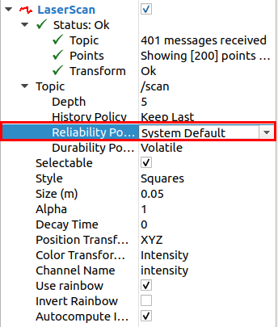
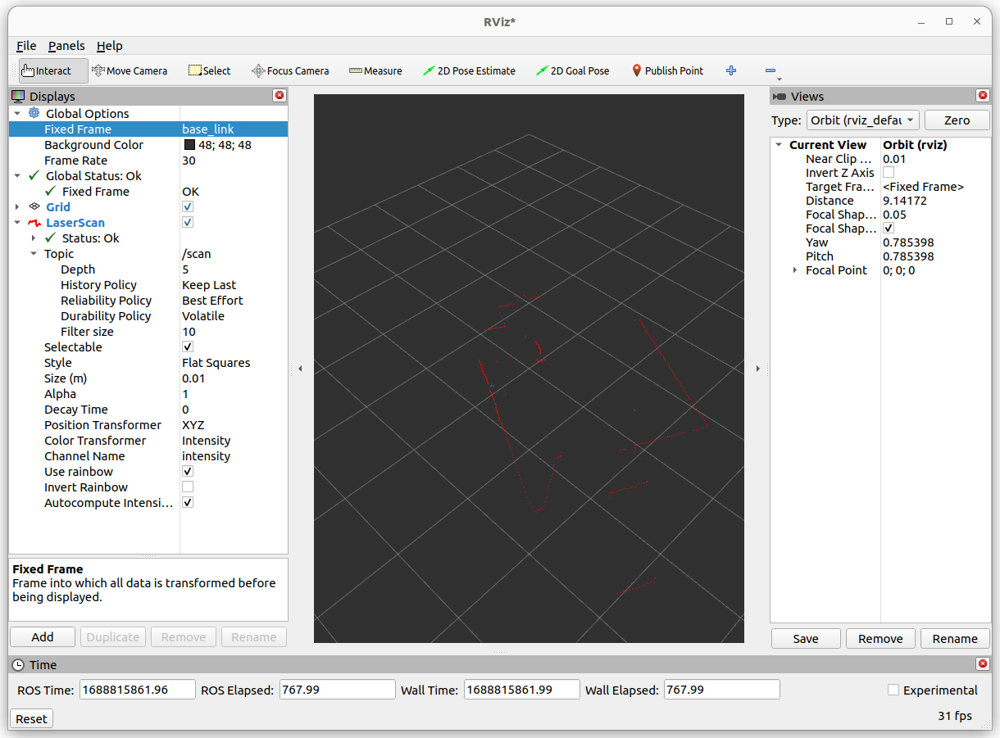

English| [简体中文](./README_cn.md)

# Function Introduction

LDLIDAR ROS2 driver sends laser radar data in ROS2 standard message format.

# Item List

For detailed product models, please refer to [LDLIDAR official website](https://www.ldrobot.com/) using LDLIDAR X3 as an example.


| Item Option    | Inventory      | 
| ------- | ------------ | 
| RDK X3  | [Purchase Link](https://developer.horizon.ai/sunrise) | 
| LDLIDAR X3 | [Purchase Link](https://www.ldrobot.com/ProductDetails?sensor_name=LD08) | 

# Usage

## Preparation

1. The Horizon RDK has been flashed with the Ubuntu 20.04 system image provided by Horizon.

2. LDLIDAR correctly connected to RDK X3.

## Installing the LDLIDAR Driver

Connect to RDK X3 via terminal or VNC, and execute the following commands:

```bash
sudo apt update
sudo apt install -y tros-ldlidar_ros2
```
**Note: If LDLIDAR is connected to RDK X3 during installation, it needs to be plugged in again after installation.**

## Running LDLIDAR

```bash
source /opt/tros/setup.bash
ros2 launch ldlidar_ros2 ld06.launch.py
```

## Viewing Radar Data


### Method 1: Command Line

Open a new terminal and enter the following command to view laser radar output data:


```bash
source /opt/tros/setup.bash
ros2 topic echo /scan
```
### Method 2: Using Foxglove Visualization


***Note: The device running Foxglove Studio should be on the same network segment as the RDK device.***

1. Go to the Foxglove [official website](https://foxglove.dev/download) to download Foxglove Studio and install it on your PC.
2. Open a new terminal on RDK and enter the following command to install rosbridge:

```bash
sudo apt install ros-foxy-rosbridge-suite
```

3. Run the following command to start rosbridge:

```bash
source /opt/tros/setup.bash
ros2 launch rosbridge_server rosbridge_websocket_launch.xml
```
4. Open Foxglove Studio, select "Open Connection," choose rosbridge as the connection method in the subsequent dialog, and enter the RDK's IP address instead of localhost.


5.In Foxglove Studio, click the "Settings" button in the upper right corner, and in the panel that pops up on the left, configure the radar topic to be "visible." At this point, the studio will display the radar point cloud in real-time.


### Method 3: RVIZ

Install ROS2 on a PC or an environment that supports RVIZ. Here, we take the foxy version as an example, run:
```bash
source /opt/ros/foxy/setup.bash
ros2 run rviz2 rviz2
```

Add LaserScan and configure the Reliability Policy as System Default.



Set Fixed Frame to base_link or laser_link to see the laser radar collected data.




# Interface Specification


## Topic

### Published Topic
| Topic                | Type                    | Description                                      |
|----------------------|-------------------------|--------------------------------------------------|
| `scan`               | sensor_msgs/LaserScan   | Two-dimensional laser radar scan data                |
| `pointcloud2d`       | sensor_msgs/PointCloud   | Two-dimensional laser radar 2D point cloud data                |


## Parameters
| Parameter name          | Data Type | Detail                                                        |
| ----------------------- | --------- | ------------------------------------------------------------ |
| frame_id                | string    | Default value for frame name: `laser_frame`                 |
| product_name            | string    | Radar type names: `LDLiDAR_LD14`,`M10_P`,`M10_PLUS`,`M10_GPS`,`N10`,`L10`,`N10_P` |
| port_name               | string    | Set the port number of the laser radar device<br/>For example, serial port `/dev/ttyUSB0` |
| serial_baudrate         | int       | Serial port baud rate.<br/>Default value: `115200`           |
| enable_angle_crop_func  | bool      | Enable angle cropping function.<br/>Default value: `False`   |
| angle_crop_min          | float     | Starting angle for cropping.<br/>Default value: `135.0`      |
| angle_crop_max          | float     | Ending angle for cropping.<br/>Default value: `225.0`        |
| range_min               | float     | Minimum distance received by radar.<br/>Default value: `0.02`|
| range_max               | float     | Maximum distance received by radar.<br/>Default value: `8.0` |
| scan_topic              | string    | Set the topic name for laser data: `/scan`                   |
| point_cloud_2d_topic_name | string   | Set the topic name for laser data: `/pointcloud2d`           |


